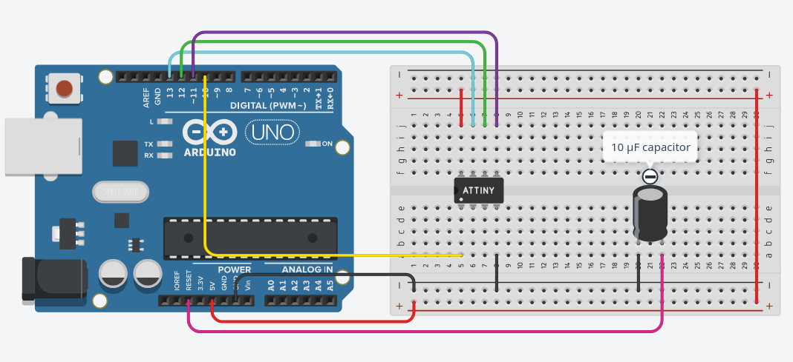

## ATtiny85 I2C Slave

### Purpose
Since the Raspberry Pi Zero W does not have a built-in ADC as well as the ability to set GPIO pins on HIGH immediately after being started, it was necessary to add a small microcontroller to our Raspberry Pi HAT. In our case it is the ATtiny85, which is responsible for controlling the status LED, keeping the power supply alive and measuring the battery voltage to estimate the state of charge.

### Commands

I2C address: 0x08

| Command  |   Code   | Response |
|----------|----------|----------|
| Set green status LED    | 0x01   | Nothing   |
| Set red status LED    | 0x02   | Nothing   |
| Turn off transistor    | 0x03   | Nothing   |
| Measure battery voltage    | 0x04   | Raw 10-bit ADC value  |

### Flashing
#### Requirements: 
- Arduino Uno
- ATtiny85
- Jumper wires
- A breadboard

#### Preparation:
1. Connect the Arduino Uno to your computer via USB. Open Arduino IDE and click on File -> Examples -> 11. ArduinoISP -> ArduinoISP. This will open the script for using the Arduino Uno as an ISP programmer.
2. Select the port of your Arduino Uno connected to your PC under Tools -> Port.
3. Press the upload button. This will make your Arduino Uno be able to upload code to the ATtiny85.
4. Connect the ATtiny to the Arduino Uno as shown in the image below. **Before wiring, please disconnect the USB cable!**


#### Programming the ATtiny85

5. Add your user to the dialout group to communicate via RS232 with the Arduino Uno: ```sudo usermod -aG dialout $USER```. After this, **log out and back in!**
6. Open this directory in VSCode. In order to flash the ATtiny85, you'll need PlatformIO. Installation instructions can be found on the [official PlatformIO site](https://docs.platformio.org/en/latest/integration/ide/vscode.html#installation)
7. Set the upload port to the one of the Arduino Uno. Open the command palette and type "PlatformIO: Set project port".
8. Next, upload the firmware to the ATtiny85. Type "PlatformIO: Upload" in the command palette.
9. If no error occurs, the newly flashed ATtiny85 is ready to use as an I2C slave for the EyeAIVision Pro!

### Testing

See [MasterTestCode](./MasterTestCode/README.md)
